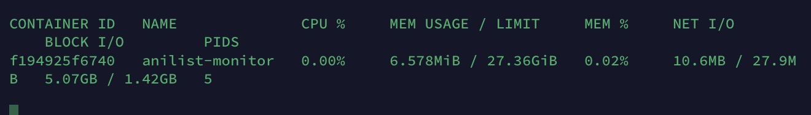

<!-- Template Plagarised from https://github.com/othneildrew/Best-README-Template -->
<a id="readme-top"></a>
<br />
<div align="center">
  <a href="github.com/acoffeee/anilist-api-checker">
        
  </a>

  <h3 align="center">Best-README-Template</h3>

  <p align="center">
    An awesome, simple multi regional api monitor
    <br />
    <a href="https://al-api.coffeee.org/">View Demo</a>
    &middot;
    <a href="https://github.com/acoffeee/anilist-api-checker/issues"> Report Bug </a>
    &middot;
    <a href="https://github.com/acoffeee/anilist-api-checker/issues">Request Feature</a>
  </p>
</div>


<!-- TABLE OF CONTENTS -->
<details>
  <summary>Table of Contents</summary>
  <ol>
    <li>
      <a href="#about-the-project">About The Project</a>
      <ul>
        <li><a href="#built-with">Built With</a></li>
      </ul>
    </li>
    <li>
      <a href="#getting-started">Getting Started</a>
      <ul>
        <li><a href="#prerequisites">Prerequisites</a></li>
        <li><a href="#installation">Installation</a></li>
      </ul>
    </li>
    <li><a href="#usage">Usage</a></li>
    <li><a href="#roadmap">Roadmap</a></li>
    <li><a href="#contributing">Contributing</a></li>
    <li><a href="#license">License</a></li>
    <li><a href="#contact">Contact</a></li>
    <li><a href="#acknowledgments">Acknowledgments</a></li>
  </ol>
</details>


<!-- ABOUT THE PROJECT -->
## About The Project

[![Product Name Screen Shot][product-screenshot]](https://al-api.coffeee.org/)

I built this project because i wanted an easy to deployu multi regional api prober. This project will be able to monitor any api as you want, and it is extremely light weight 

When this project is all and down i hope to have a service where anyone can load up and throw any hardware they have avbaiuable. Wether that means loading upo 5 baremetal clients on your nas and each behind gleutun with a different loaction or if it means hooking up and deploying 5 aws lambda functions, 4 azura, 3 vps probers, and throw it on your seedbox cause why not you dont have a europe location yet i just want it to be super easy and versitile.
<p align="right">(<a href="#readme-top">back to top</a>)</p>


<!-- GETTING STARTED -->
## Getting Started

This is an example of how you may give instructions on setting up your project locally.
To get a local copy up and running follow these simple example steps.
> **NOTE** This section will not be filled in untill i actaully get the first release out
### Prerequisites

This is an example of how to list things you need to use the software and how to install them.
* rust
  ```rust
  cargo build
  ```

### Installation

1. Get a free API Key at [https://example.com](https://example.com)
2. Clone the repo
   ```sh
   git clone https://github.com/acoffeee/anilist-api-checker.git
   ```
3. Install NPM packages
   ```sh
   npm install
   ```
4. Enter your API in `config.js`
   ```js
   const API_KEY = 'ENTER YOUR API';
   ```
5. Change git remote url to avoid accidental pushes to base project
   ```sh
   git remote set-url origin acoffeee/anilist-api-checker
   git remote -v # confirm the changes
   ```

<p align="right">(<a href="#readme-top">back to top</a>)</p>


<!-- USAGE EXAMPLES -->
## Usage

Use this space to show useful examples of how a project can be used. Additional screenshots, code examples and demos work well in this space. You may also link to more resources.

_For more examples, please refer to the [Documentation](https://example.com)_

<p align="right">(<a href="#readme-top">back to top</a>)</p>


<!-- ROADMAP -->
## Roadmap

- [ ] OIDC Support for admin login pannel
- [ ] Possibly dynamically adding secrets, like rn u can dynamically add arns but not secrets
- [ ] Notifications
    - [ ] Slack
    - [ ] Discord
    - [ ] Email
    - [ ] Telegram
    - [ ] SMS
    - [ ] Possibly allow a non admin user to hook into it?
- [ ] Possibly allow multiple apis, but may not happen bc i want to keep it as light as possibly
- [ ] Baremetal non root client options
- [ ] Better DB Support, possibly postgres or Veronica 
    - [ ] allow clients to hit the db directly if main server is down to allow for migrations
- [ ] Support for more apis than the al api lol
    - [ ] Restful
    - [ ] GQL
        - [ ] allow the admin to configure custom queries
    - [ ] gRPC /RPC 
    - [ ] SOAP
    - [ ] Websockets
    - [ ] webhooks
    - [ ] udp apis (looking at you anidb)

See the [open issues](https://github.com/acoffeee/anilist-api-checker/issues) for a full list of proposed features (and known issues).

<p align="right">(<a href="#readme-top">back to top</a>)</p>


<!-- CONTRIBUTING -->
## Contributing

Contributions are what make the open source community such an amazing place to learn, inspire, and create. Any contributions you make are **greatly appreciated**.

If you have a suggestion that would make this better, please fork the repo and create a pull request. You can also simply open an issue with the tag "enhancement".
Don't forget to give the project a star! Thanks again!

1. Fork the Project
2. Create your Feature Branch (`git checkout -b feature/AmazingFeature`)
3. Commit your Changes (`git commit -m 'Add some AmazingFeature'`)
4. Push to the Branch (`git push origin feature/AmazingFeature`)
5. Open a Pull Request

<p align="right">(<a href="#readme-top">back to top</a>)</p>

### Top contributors:

<a href="https://github.com/acoffeee/anilist-api-checker/graphs/contributors">
  
</a>


<!-- LICENSE -->
## License

Distributed under the project_license. See `LICENSE.txt` for more information.

<p align="right">(<a href="#readme-top">back to top</a>)</p>


<!-- CONTACT -->
## Contact
Project Link: [https://github.com/acoffeee/anilist-api-checker](https://github.com/acoffeee/anilist-api-checker)

<p align="right">(<a href="#readme-top">back to top</a>)</p>


<!-- ACKNOWLEDGMENTS -->
## Acknowledgments

* []()
* []()
* []()

<p align="right">(<a href="#readme-top">back to top</a>)</p>


<!-- MARKDOWN LINKS & IMAGES -->
<!-- https://www.markdownguide.org/basic-syntax/#reference-style-links -->
[contributors-shield]: https://img.shields.io/github/contributors/acoffeee/anilist-api-checker.svg?style=for-the-badge
[contributors-url]: https://github.com/acoffeee/anilist-api-checker/graphs/contributors
[forks-shield]: https://img.shields.io/github/forks/acoffeee/anilist-api-checker.svg?style=for-the-badge
[forks-url]: https://github.com/acoffeee/anilist-api-checker/network/members
[stars-shield]: https://img.shields.io/github/stars/acoffeee/anilist-api-checker.svg?style=for-the-badge
[stars-url]: https://github.com/acoffeee/anilist-api-checker/stargazers
[issues-shield]: https://img.shields.io/github/issues/acoffeee/anilist-api-checker.svg?style=for-the-badge
[issues-url]: https://github.com/acoffeee/anilist-api-checker/issues
[license-shield]: https://img.shields.io/github/license/acoffeee/anilist-api-checker.svg?style=for-the-badge
[license-url]: https://github.com/acoffeee/anilist-api-checker/blob/master/LICENSE.txt
[product-screenshot]: images/demo.png
<!-- Shields.io badges. You can a comprehensive list with many more badges at: https://github.com